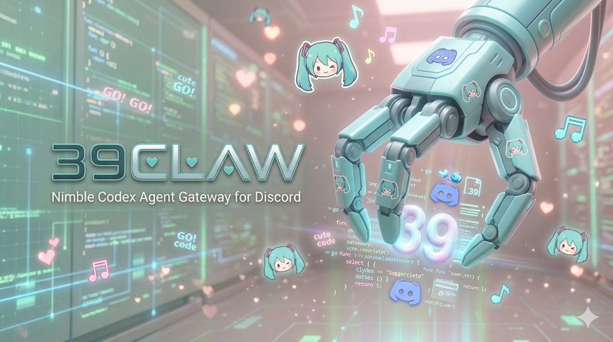

# 39claw



39claw is a Discord bot that connects your Discord conversations to Codex.

It is built for teams or individuals who want to work with Codex from inside Discord without inventing their own thread-routing rules. You mention the bot, 39claw decides which Codex thread should receive the turn, and the reply comes back into the same channel.

## What You Get

- mention-based conversation in Discord
- two conversation modes for different workflows
- slash commands for help and task control
- SQLite-backed continuity across restarts
- image attachment support for mention-triggered turns
- queued acknowledgments when the same conversation is already busy

## Conversation Modes

39claw runs in exactly one mode per bot instance.

### `daily`

Use `daily` mode when you want a lightweight shared assistant for day-to-day work.

- messages on the same local date share the same conversation context
- the next local date starts fresh automatically
- users do not need to create or switch tasks before talking

### `task`

Use `task` mode when you want durable work streams that continue across multiple days.

- each user works through an explicit active task
- `/task ...` commands control which task is active
- normal conversation does not run until a task is selected

## How It Behaves in Discord

### Normal conversation

- 39claw responds only when the bot is mentioned
- a qualifying message may contain text, images, or both
- if the mention includes no text and no usable image, the bot stays silent
- replies are posted in the same channel as replies to the triggering message

### Commands

- `/help`
  - show the supported command surface for the current bot instance
- `/task current`
  - show the active task
- `/task list`
  - list open tasks and mark the active one
- `/task new <name>`
  - create a task and make it active
- `/task switch <id>`
  - switch the active task
- `/task close <id>`
  - close a task

In `daily` mode, `/task ...` commands return a clear not-available response instead of pretending they worked.

### Busy conversations

39claw runs one Codex turn at a time for a given conversation context.

- if another message arrives while that context is busy, the bot can queue up to five waiting messages
- queued messages receive a short acknowledgment immediately
- the final answer arrives later as a reply to the queued message
- if the queue is already full, the bot returns a retry-later response

Queued messages are held in memory, so they are lost if the bot process exits before they run.

## Requirements

Before you start, make sure you have:

- a Discord bot token
- the `codex` executable available on the machine that runs 39claw
- a writable SQLite file path
- a working directory that Codex should operate in
- Go installed if you plan to run from source

## Local Secret Workflow

The recommended local-development workflow is:

1. copy `.env.example` to `.env.local`
2. replace every placeholder in `.env.local`
3. copy `.envrc.example` to `.envrc`
4. run `direnv allow`
5. start 39claw without pasting secrets into shell history

`.env.local`, `.envrc`, and `.direnv/` are ignored by Git in this repository.
Keep real Discord tokens, Codex API keys, and any other credentials only in those ignored files.
Checked-in examples must contain placeholders only.
If you do not use `direnv`, keep the same rule: load secrets from an ignored local file instead of tracked scripts or inline launch snippets.

<details>
<summary>Codex Installation Guide</summary>

39claw launches the local `codex` CLI, so install Codex before starting the bot.

Recommended installation options:

- install with npm
- install with Homebrew
- download a release binary from GitHub if you prefer a manual install

### Install with npm

```bash
npm install -g @openai/codex
```

### Install with Homebrew

```bash
brew install --cask codex
```

### Install from a GitHub release

If you do not want to use a package manager, download the correct archive for your platform from the Codex GitHub releases page and extract the binary.

After extraction, you will usually want to rename the binary to `codex` and place it somewhere on your `PATH`.

### Confirm the install

Run:

```bash
codex
```

The official quick start then recommends signing in with ChatGPT. Codex can also be used with an API key, but that requires additional setup on the Codex side.

Official references:

- [OpenAI Codex README](https://github.com/openai/codex/blob/main/README.md)
- [Codex documentation](https://developers.openai.com/codex)

</details>

<details>
<summary>Discord Setup Guide</summary>

If this is your first time running a Discord bot, do this before the quick start.

### 1. Create the bot application

- open the Discord Developer Portal
- create a new application
- add a Bot user to that application
- copy the bot token and store it in your ignored `.env.local` file as `CLAW_DISCORD_TOKEN`

### 2. Enable the required intent

In the bot settings, enable **Message Content Intent**.

39claw reads the content of mention-triggered messages, so this intent is required for normal conversation in guild channels.

### 3. Generate an invite URL

Under OAuth2, generate an invite URL for the bot.

Use these scopes:

- `bot`
- `applications.commands`

`applications.commands` is required because 39claw registers slash commands such as `/help` and `/task ...`.

### 4. Grant the right bot permissions

Recommended permissions:

- `View Channels`
- `Send Messages`
- `Read Message History`

Useful optional permissions:

- `Embed Links`
- `Attach Files`

### 5. Invite the bot to a test server

Invite the bot to an existing Discord server that you control.

39claw does not create a new server for you. It connects to Discord and listens in the server where the bot has been installed.

### 6. Pick a safe place to test

For first-time setup, it is easiest to use one dedicated test server or one dedicated bot channel.

If you set `CLAW_DISCORD_GUILD_ID`, 39claw registers slash commands in that guild for faster testing. This is usually the best choice while you are still validating the setup.

### 7. Know what to expect in the channel

- normal conversation is mention-only
- slash commands are explicit and do not require a mention
- in `task` mode, users must create or switch to a task before normal conversation will run

</details>

## Quick Start

### 1. Choose a mode

Pick one:

- `CLAW_MODE=daily`
- `CLAW_MODE=task`

### 2. Set the required environment variables

The safe-default setup is to keep your local values in `.env.local` and load them through `.envrc`.
Start by copying `.env.example` to `.env.local`, then replace the placeholders with real local values.

These variables are required in `.env.local`:

- `CLAW_MODE`
- `CLAW_TIMEZONE`
- `CLAW_DISCORD_TOKEN`
- `CLAW_CODEX_WORKDIR`
- `CLAW_DATADIR`
- `CLAW_CODEX_EXECUTABLE`

Recommended startup flow:

```bash
cp .env.example .env.local
cp .envrc.example .envrc
direnv allow
go run ./cmd/39claw
```

39claw stores its SQLite database at `39claw.sqlite` inside `CLAW_DATADIR`.

If `CLAW_DISCORD_GUILD_ID` is set, 39claw registers commands in that guild for faster testing. If it is omitted, commands are registered globally.

### 3. Mention the bot in Discord

Try one of these:

- mention the bot with a text prompt
- mention the bot with text plus an image
- mention the bot with only an image

If you are running in `task` mode, create a task first with `/task new <name>`.

## Configuration Reference

### Required variables

- `CLAW_MODE`
  - `daily` or `task`
- `CLAW_TIMEZONE`
  - the timezone used for daily rollover
- `CLAW_DISCORD_TOKEN`
  - Discord bot token stored in your ignored local env file
- `CLAW_CODEX_WORKDIR`
  - working directory passed to Codex
- `CLAW_DATADIR`
  - directory used for local state; the SQLite database path is fixed to `39claw.sqlite` inside this directory
- `CLAW_CODEX_EXECUTABLE`
  - path to the `codex` executable

### Useful optional variables

- `CLAW_DISCORD_GUILD_ID`
  - register slash commands in one guild for faster iteration
- `CLAW_LOG_LEVEL`
  - logging level, default `info`
- `CLAW_CODEX_MODEL`
  - choose a Codex model
- `CLAW_CODEX_BASE_URL`
  - override the Codex base URL
- `CLAW_CODEX_API_KEY`
  - provide an API key when needed
- `CLAW_CODEX_SANDBOX_MODE`
  - `read-only`, `workspace-write`, or `danger-full-access`
- `CLAW_CODEX_ADDITIONAL_DIRECTORIES`
  - extra writable directories, separated by the OS path-list separator
- `CLAW_CODEX_SKIP_GIT_REPO_CHECK`
  - `true` or `false`
- `CLAW_CODEX_APPROVAL_POLICY`
  - `never`, `on-request`, `on-failure`, or `untrusted`
- `CLAW_CODEX_MODEL_REASONING_EFFORT`
  - `minimal`, `low`, `medium`, `high`, or `xhigh`
- `CLAW_CODEX_WEB_SEARCH_MODE`
  - `disabled`, `cached`, or `live`
- `CLAW_CODEX_NETWORK_ACCESS`
  - `true` or `false`

## Smoke Test Checklist

After startup, confirm the basics:

- mention the bot and confirm the reply targets the original message
- mention the bot with text plus an image and confirm the request is handled
- mention the bot with only an image and confirm the bot still answers
- send unrelated chatter without a mention and confirm the bot stays silent
- run `/help` and confirm it matches the configured mode
- in `task` mode, run `/task new <name>` and confirm the response is ephemeral
- send overlapping messages for the same conversation and confirm the later one is queued
- send a long Codex response and confirm the bot splits it into readable Discord-safe chunks

## Current Status

39claw is still early-stage software, but the current build already supports:

- mention-only normal conversation
- mention-triggered image attachment intake
- `daily` and `task` conversation modes
- `/help`
- `/task current`, `/task list`, `/task new`, `/task switch`, and `/task close`
- SQLite-backed persistence for thread bindings and task state
- queued acknowledgments with deferred follow-up replies

## Learn More

For deeper detail, start here:

- [docs/product-specs/discord-command-behavior.md](./docs/product-specs/discord-command-behavior.md)
- [docs/product-specs/daily-mode-user-flow.md](./docs/product-specs/daily-mode-user-flow.md)
- [docs/product-specs/task-mode-user-flow.md](./docs/product-specs/task-mode-user-flow.md)
- [docs/index.md](./docs/index.md)
- [ARCHITECTURE.md](./ARCHITECTURE.md)
