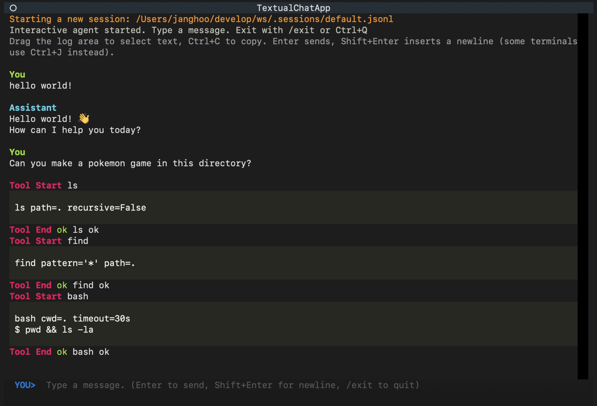

# py-pimono



Language: [English](README.md) | [한국어](README.kr.md)

`py-pimono` is a local coding agent and a Python reimplementation of [`pi-mono`](https://github.com/mariozechner/pi-mono).

This repository exists for two reasons:

1. To break a code agent into three clearly separated hexagons so learners can understand the core loop, session orchestration, and UI path without digging through a giant codebase.
2. To provide a clean starting point for building your own agent on top of a well-isolated Python codebase.

If you want the deeper layout, call flow, and configuration reference, see [ARCHITECTURE.md](ARCHITECTURE.md). Korean versions are available in [README.kr.md](README.kr.md) and [ARCHITECTURE.kr.md](ARCHITECTURE.kr.md).

## Quickstart

### Sync the project and run it

By default, `py-pimono` uses the Codex path and starts the `textual` UI.

```bash
uv sync --extra ui
uv run pyai
```

If Codex is not configured yet and you just want to see the app run, force the mock provider at launch time:

```bash
PI_LLM_PROVIDER=mockllm uv run pyai
```

If you prefer plain terminal output instead of the default `textual` UI:

```bash
PI_OUTPUT_STYLE=plain uv run pyai
```

If `pyai` is unavailable in your environment, run the module directly instead:

```bash
python3 -m pypimono
```

The same idea applies to the other examples above: replace `pyai` with `python3 -m pypimono`.

### Optional Notion MCP login

The Notion hosted MCP integration is optional. If you want to enable it, complete the OAuth login once and sync the tool manifest:

```bash
uv run -m pypimono mcp notion login
```


### Run with Discord bot interface

You can run `py-pimono` as a Discord chat bot while keeping the same engine/session architecture.

```bash
uv sync --extra discord
PI_OUTPUT_STYLE=discord \
PI_DISCORD_BOT_TOKEN=<your-bot-token> \
PI_DISCORD_CHANNEL_ID=<optional-channel-id> \
uv run pyai
```

In guild channels, mention the bot like `@YourBot refactor this function`. In 1:1 DMs, just send the prompt directly.

> Note: this does **not** start a new Discord server (guild).  
> It starts a bot process that connects to Discord and listens in existing guild channels and/or DMs.

#### Discord setup guide (permissions, DM, and guild usage)

1. **Create a bot in Discord Developer Portal**
   - Create an Application, then add a Bot user.
   - Generate/copy the bot token and set it as `PI_DISCORD_BOT_TOKEN`.

2. **Enable Privileged Gateway Intents**
   - Enable **Message Content Intent** in the Bot settings.
   - This implementation reads message content after a bot mention in guild channels, and directly in DMs.

3. **Create an invite URL (OAuth2)**
   - Scopes: `bot` (add `applications.commands` only if you plan slash commands later).
   - Recommended bot permissions:
     - `View Channels`
     - `Send Messages`
     - `Read Message History`
     - Optional: `Embed Links`, `Attach Files`

4. **Choose where the bot responds**
   - Set `PI_DISCORD_CHANNEL_ID` to restrict guild-channel responses to one channel (recommended for team usage).
   - DMs still work without a channel ID.

5. **Can it work in 1:1 DMs?**
   - Yes.
   - In practice, users usually need to open the DM first (or share a guild with the bot, depending on privacy settings).

6. **Ops tips**
   - For safer team usage, lock to one dedicated channel with `PI_DISCORD_CHANNEL_ID`.
   - In guild channels, the bot only responds when explicitly mentioned.


### Local development

If you want to modify the code locally, clone the repository and sync the development environment with `uv`:

```bash
git clone https://github.com/solvit-team/py-pimono
cd py-pimono
uv sync --group dev
uv run pyai
```

## vs pi-ai

This repository is closer to a clean, hackable starting point than a polished end-user app.

### Why reimplement it?

- I broadly agree with `pi-mono`'s philosophy and direction.
- I spend a lot of time writing Python backends, and it has been surprisingly hard to experiment with placing an AI agent directly inside domain logic.
- Even repositories that call themselves minimal are usually still large enough that it is hard to tell which pieces you actually need and how they should map into an application or domain layer.
- For me, it matters more that the core agent loop and its interactions are easy to see, isolate, and reuse than that the project starts with every edge case already covered.

### Where it differs from pi-mono

- Although this repo is inspired by `pi-mono`, it intentionally makes a few different tradeoffs from the direction described in the creator's [blog post](https://mariozechner.at/posts/2025-11-30-pi-coding-agent/).
- It prefers a single, explicit model path over multi-provider context handoff. I also think frequent mid-session model switching leaves performance on the table because it works against KV cache reuse.
- It stays small on purpose. Streaming output, slash commands, and similar layers can be added later if you actually need them.
- In practice, this repo aims to be a genuinely minimal codebase for reading, modifying, and reusing agent logic.

## Structure Overview

The core is split into three hexagons, plus an integration layer that keeps the boundaries clean.

### Engine

The `engine` hexagon owns the agent loop, LLM calls, and tool execution.

If you want to change the core loop, add tools, adjust model integration, or experiment with agent behavior, this is the part to read first.

### Session

The `session` hexagon owns persistence, restoration, system prompt assembly, and turn orchestration.

If you want to store sessions in the cloud, manage multiple sessions, or change how conversation history is restored and replayed, this is the part to work on.

### UI

The `ui` hexagon turns session events into something that can be displayed and rendered in a console or TUI.

If you want to change how tool output is presented, decide what the user sees, or move the agent to another UI surface, this is the layer to start from.

### Assembly

The adapters that connect the hexagons live under `pypimono/integration`, and the full application is wired together by `AppContainer`.

```text
pypimono.cli:main
  -> AppContainer
    -> EngineContainer
    -> SessionContainer
    -> UiContainer
    -> integration containers
```

For the detailed layout, directory map, and request flow, see [ARCHITECTURE.md](ARCHITECTURE.md).
